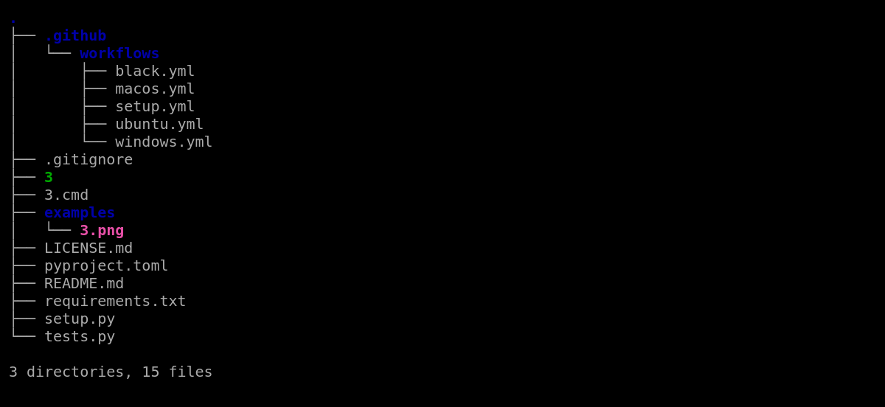

# `3`

[](https://github.com/excitoon/3/actions/workflows/black.yml)
[](https://github.com/excitoon/3/actions/workflows/ubuntu.yml)
[](https://github.com/excitoon/3/actions/workflows/macos.yml)
[](https://github.com/excitoon/3/actions/workflows/windows.yml)
[](https://badge.fury.io/py/3-py)

`.gitignore`-aware tree tool written in Python.

Example:

```
3
```

Output:



## Install

```
pip3 install 3-py
```

### Compatibility

If you are on Windows, install `colorama` in order to watch some colors.
